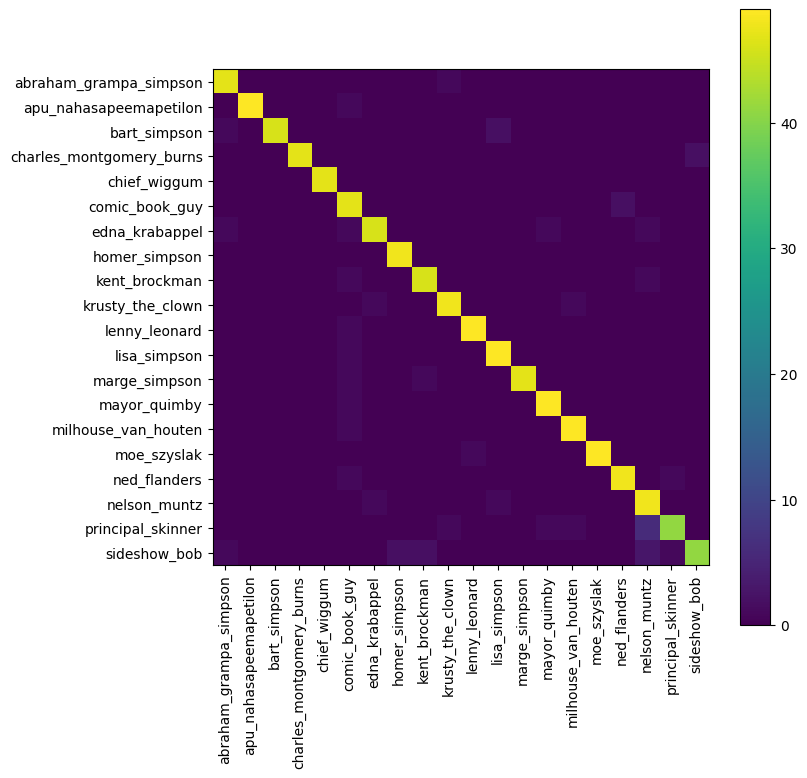

# Simpsons character classification

Using Tensorflow's Keras.

**ACKNOWLEDGEMENT**: Most of this repo is based on [alexattia's Kaggle kernel](https://www.kaggle.com/alexattia/visualizing-predicted-characters)

## Model

The model is a simple Convolutional Neural Network with the following structure:

- Convolutional layer + RELU
- Dropout + Batch Normalization
- Convolutional layer + RELU
- Max Pooling layer
- Dropout + Batch Normalization
- Structure above repeated 3 times ...
- Flattening layer
- (Dense + RELU + Dropout + Batch Normalization) x 2
- Dense with SoftMax Activation

## Dataset

This repo uses the [Kaggle Simpsons Dataset](https://www.kaggle.com/alexattia/the-simpsons-characters-dataset) from [alexattia](https://www.kaggle.com/alexattia).

One of the main challenges for this dataset was the data preprocessing, as there were several labels missing data, or some labels with two much data (i.e *Homer Simpson*).

The data cleaning analisis can be found [here](server/notebooks/data_cleaning.ipynb).

## Train

- download the [dataset](https://www.kaggle.com/alexattia/the-simpsons-characters-dataset).
- install the [requirements](requirements.txt)
- run the script:

```
python source/train.py \
	--dataset_path path/to/downloaded/dataset \
	--output_path path/to/model/output
```

This script will create a folder `output_path/v<VersionNumber>`, and will store:

- checkpoints in `output_path/v<Version>/chcks`
- training history in `output_path/v<Version>/history.csv`
- tensorboard logs in `output_path/v<Version>/logs`
- labels in `output_path/v<Version>/labels.txt` (the labels resulting from the dataset cleaning)

## Test

To test an existing model run the script `source/test.py`, example:

```
python source/test.py \
	--weights model/v1/chcks/chck_30.h5 \
	--model_path model/v1 \
	--testset_path path/to/testet
```

This script will generate the following reports:

- results per image in testset in `output_path/v<Version>/test_results.csv`
- sklearn class report in `output_path/v<Version>/class_report.csv`
- confusion matrix in `output_path/v<Version>/confusion_matrix.png`
- test viz in `output_path/v<Version>/test_viz.png`


## Results

Here are some partial results:

##### Confusion matrix:



##### Results visualization:


## CREDITS

- [Kaggle Dataset (alexattia)](https://www.kaggle.com/alexattia/the-simpsons-characters-dataset)
- [Medium Simpsons Character Recognition (alexattia)](https://medium.com/alex-attia-blog/the-simpsons-character-recognition-using-keras-d8e1796eae36)
- [Test visualization (alexattia)](https://www.kaggle.com/alexattia/visualizing-predicted-characters)